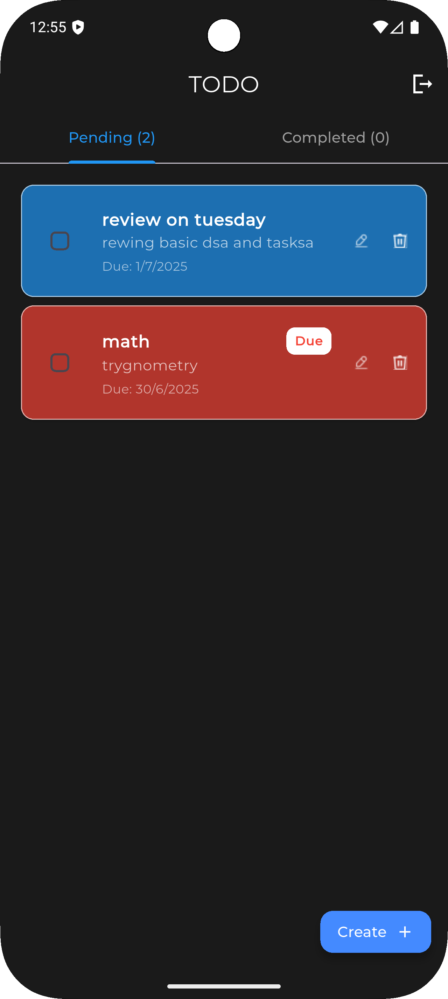
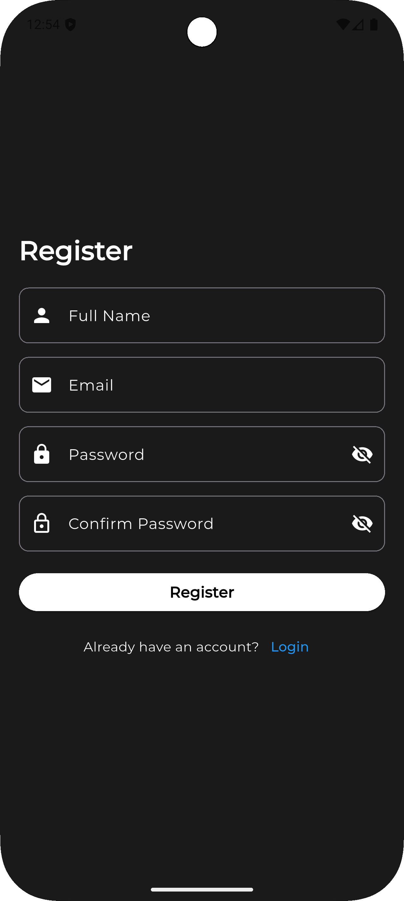
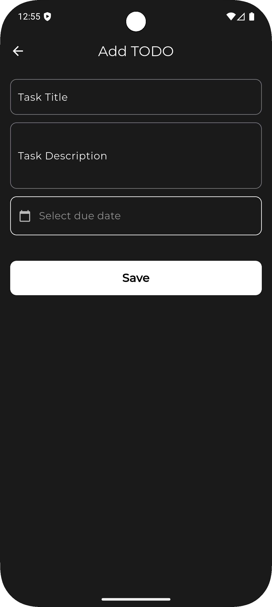

# 📝 Flutter To-Do App

A simple and intuitive To-Do app built with Flutter. Users can register, log in, and manage tasks with a clean and modern UI.

---

## 🚀 Features

- 🔐 User authentication (Register & Login)
- ➕ Add new tasks
- ✅ Mark tasks as complete
- 🗑️ Delete tasks
- 📱 Modern UI with responsive design
- 💾 Local persistence or Firebase backend (if configured)
- 🌍 (Optional) Task sharing functionality

---

## 📱 Screenshots

| Splash Screen | Home Screen |
|---------------|-------------|
|  |  |

| Register Screen | Create Todo |
|------------------|--------------|
|  |  |

---

## 🧑‍💻 Getting Started

### Prerequisites

- Flutter SDK [Installation Guide](https://flutter.dev/docs/get-started/install)
- Android Studio or Visual Studio Code
- Git installed
- Emulator or physical device

---

### 🔧 Installation

1. **Clone the repository**
   ```bash
   git clone https://github.com/your-username/todo_app.git
   cd todo_app
